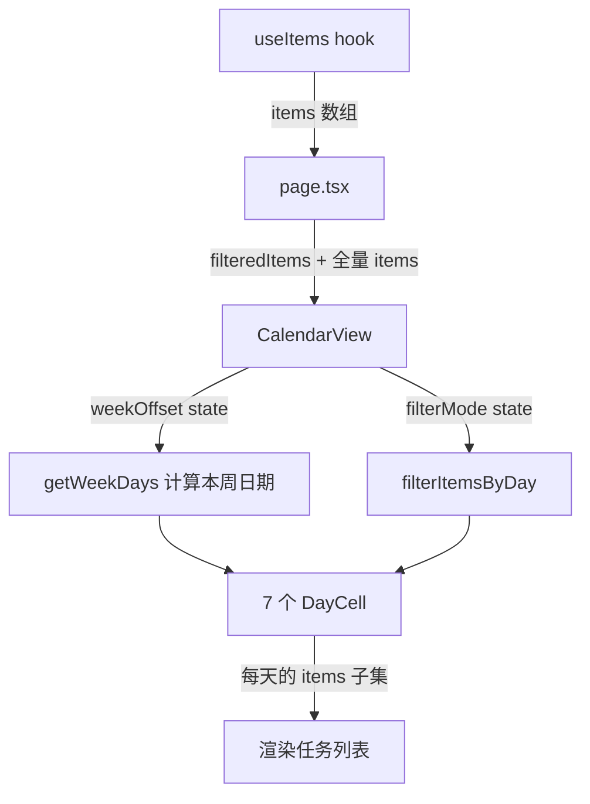

# Design Document: Calendar View

## Overview

为 Focus Flow 增加日历视图（Calendar View），作为第三个视图 tab，以周为维度展示每天新增和完成的任务。该功能填补现有视图缺少时间维度回顾能力的空白。

**核心设计决策：**

1. **纯客户端日期计算** — 所有周/日计算在浏览器端完成，不依赖外部库。原因：项目约束明确"不引入新依赖"，且周日期计算逻辑简单（加减天数），原生 Date API 完全胜任。
2. **基于现有 items 数组过滤** — 不创建新的数据结构或索引，直接从 `useItems` 返回的 items 数组按日期过滤。原因：当前数据量级（桌面单用户）不需要索引优化，且避免引入数据同步问题。
3. **组件内聚** — 日历视图作为独立组件文件，不修改现有 FlowView/ProjectOverview 的内部逻辑。原因：最小化变更范围，降低回归风险。

## Architecture

### 组件层次

```
page.tsx (viewMode state 扩展为 "flow" | "board" | "calendar")
└── CalendarView (新组件)
    ├── WeekNavigator (周导航：上一周/下一周/回到本周 + 日期范围显示)
    ├── FilterBar (筛选栏：全部/新增/完成)
    └── DayCell × 7 (每天的任务展示格子)
```

### 数据流



**为什么传全量 items 而非 filteredItems：** 日历视图需要展示已完成任务（status === "done"），而 page.tsx 的 `filteredItems` 已排除 done/archived 状态。日历视图需要自己的过滤逻辑，基于 `createdAt` 和 `completedAt` 时间戳。

## Components and Interfaces

### 1. ViewMode 类型扩展

**文件：** `src/lib/focus-flow-model.ts`

```typescript
// 修改前
export type ViewMode = "flow" | "board";

// 修改后
export type ViewMode = "flow" | "board" | "calendar";
```

### 2. CalendarView 组件

**文件：** `src/components/focus-flow/calendar-view.tsx`

```typescript
type CalendarFilter = "all" | "created" | "completed";

type CalendarViewProps = {
  items: Item[];
  getProjectById: (id?: string) => Project;
};

export function CalendarView({ items, getProjectById }: CalendarViewProps) {
  const [weekOffset, setWeekOffset] = useState(0); // 0 = 本周, -1 = 上周, 1 = 下周
  const [filter, setFilter] = useState<CalendarFilter>("all");

  const weekDays = getWeekDays(weekOffset);
  const weekLabel = formatWeekRange(weekDays[0], weekDays[6]);

  return (/* ... */);
}
```

### 3. WeekNavigator 子组件

```typescript
type WeekNavigatorProps = {
  weekLabel: string;       // "6/16 - 6/22"
  isCurrentWeek: boolean;  // weekOffset === 0
  onPrev: () => void;
  onNext: () => void;
  onToday: () => void;
};
```

### 4. FilterBar 子组件

```typescript
type FilterBarProps = {
  filter: CalendarFilter;
  onChange: (filter: CalendarFilter) => void;
};
```

### 5. DayCell 子组件

```typescript
type DayCellProps = {
  date: Date;
  isToday: boolean;
  createdItems: Item[];    // 该天 createdAt 匹配的任务
  completedItems: Item[];  // 该天 completedAt 匹配的任务
  filter: CalendarFilter;
  getProjectById: (id?: string) => Project;
};
```

### 6. page.tsx 集成

在 tab switcher 中增加第三个按钮，在 viewMode === "calendar" 时渲染 CalendarView：

```typescript
// Tab switcher 增加
<button onClick={() => setViewMode("calendar")} className={...}>
  日历视图
</button>

// 内容区域增加
{viewMode === "calendar" && (
  <CalendarView items={items} getProjectById={getProjectById} />
)}
```

## Data Models

### 周日期计算逻辑

**核心函数：** `getWeekDays(weekOffset: number): Date[]`

算法：
1. 取今天的日期
2. 计算今天是周几（`getDay()`，0=周日需转换为 7）
3. 回退到本周一：`today - (dayOfWeek - 1)` 天
4. 加上 `weekOffset * 7` 天得到目标周的周一
5. 从目标周一开始，生成连续 7 天的 Date 数组

**为什么以周一为起始：** 中国用户习惯周一为一周开始，且需求文档明确写"周一到周日"。

### 日期匹配逻辑

**核心函数：** `getItemsForDay(items: Item[], date: Date, filter: CalendarFilter)`

```typescript
function toDateKey(date: Date): string {
  // 返回 "YYYY-MM-DD" 格式，用于与 item.createdAt/completedAt 比较
  return `${date.getFullYear()}-${String(date.getMonth() + 1).padStart(2, '0')}-${String(date.getDate()).padStart(2, '0')}`;
}

function getItemsForDay(items: Item[], date: Date, filter: CalendarFilter) {
  const key = toDateKey(date);
  const created = items.filter(item => item.createdAt?.slice(0, 10) === key);
  const completed = items.filter(item => item.completedAt?.slice(0, 10) === key);

  switch (filter) {
    case "created": return { created, completed: [] };
    case "completed": return { created: [], completed };
    case "all": return { created, completed };
  }
}
```

**为什么用 `slice(0, 10)` 比较：** Item 的 `createdAt` 和 `completedAt` 是 ISO 字符串（如 `"2024-06-18T10:30:00.000Z"`），取前 10 位即为日期部分。但需注意时区问题——ISO 字符串是 UTC 时间，而用户看到的"今天"是本地时间。

**时区处理策略：** 查看现有代码，`getTodayKey()` 使用 `new Date()` 的本地时间方法（`getFullYear()`、`getMonth()`、`getDate()`），而 `createdAt` 通过 `new Date().toISOString()` 生成（UTC）。这意味着在 UTC+8 时区，凌晨 0:00-8:00 之间创建的任务，其 ISO 日期部分会是前一天。

**现有代码的做法：** `page.tsx` 中的 `dailyReport` 已经使用 `i.createdAt?.slice(0, 10) === todayKey` 进行比较，其中 `todayKey` 来自 `getTodayKey()`（本地日期）。这说明项目已接受这个近似——在绝大多数使用场景下（白天工作时间），UTC 日期和本地日期一致。日历视图沿用相同策略，保持一致性。

### 周范围格式化

```typescript
function formatWeekRange(start: Date, end: Date): string {
  // 返回 "6/16 - 6/22" 格式
  return `${start.getMonth() + 1}/${start.getDate()} - ${end.getMonth() + 1}/${end.getDate()}`;
}
```

### 任务展示上限

每个 DayCell 最多展示 **4 条**任务标题，超出部分显示"+N 条"。

**为什么是 4：** 七列网格布局下，每列宽度有限。4 条任务标题（每条约 20px 高度 + 间距）加上统计区域，总高度约 200px，在常见屏幕分辨率下不会导致格子过高而破坏网格对齐。


## Correctness Properties

*A property is a characteristic or behavior that should hold true across all valid executions of a system—essentially, a formal statement about what the system should do. Properties serve as the bridge between human-readable specifications and machine-verifiable correctness guarantees.*

### Property 1: Week calculation produces valid Monday-to-Sunday range

*For any* date used as "today" and any integer weekOffset, `getWeekDays(weekOffset)` SHALL return an array of exactly 7 Date objects where the first is a Monday (getDay() === 1) and the last is a Sunday (getDay() === 0), and each consecutive date is exactly 1 day after the previous.

**Validates: Requirements 2.1**

### Property 2: Day label formatting correctness

*For any* valid Date object, the formatted day label SHALL equal `"${month}/${day}"` where month = date.getMonth() + 1 and day = date.getDate(), with no zero-padding.

**Validates: Requirements 2.3**

### Property 3: Week range label formatting

*For any* Monday date (start of week), `formatWeekRange(monday, sunday)` SHALL produce a string in the format `"${startMonth}/${startDay} - ${endMonth}/${endDay}"` where the end date is exactly 6 days after the start date.

**Validates: Requirements 3.1**

### Property 4: Week navigation shifts by exactly 7 days

*For any* weekOffset and any direction (prev or next), navigating in that direction SHALL produce a new set of 7 dates where each date is exactly 7 days earlier (prev) or later (next) than the corresponding date at the original offset.

**Validates: Requirements 3.3, 3.4**

### Property 5: Day item filtering returns correct subset

*For any* list of items, any target date, and any filter mode ("all", "created", "completed"), `getItemsForDay(items, date, filter)` SHALL return:
- When filter = "created": exactly the items whose `createdAt` date portion matches the target date
- When filter = "completed": exactly the items whose `completedAt` date portion matches the target date
- When filter = "all": the union of both sets (created ∪ completed for that date)

**Validates: Requirements 2.4, 2.5, 4.3, 4.4, 4.5**

### Property 6: Overflow indicator shows correct remaining count

*For any* list of N items where N > MAX_DISPLAY_COUNT, the overflow text SHALL display `"+${N - MAX_DISPLAY_COUNT} 条"`, and exactly MAX_DISPLAY_COUNT items SHALL be rendered in the list.

**Validates: Requirements 5.3**

## Error Handling

| 场景 | 处理方式 | 原因 |
|------|----------|------|
| Item 的 createdAt 为无效日期字符串 | 该 item 不匹配任何日期，静默跳过 | 不阻塞其他正常数据的展示 |
| Item 的 completedAt 为 undefined | 该 item 不出现在"完成"列表中 | completedAt 只在 done/archived 时设置，undefined 是正常状态 |
| weekOffset 极端值（如 ±1000） | 不做限制，Date API 能正确处理 | 用户不太可能手动导航到极端周，且 Date 算术无溢出风险 |
| items 数组为空 | 展示整周空状态提示 | 明确告知用户"没有数据"而非"加载中" |
| 跨年周（如 12/30 - 1/5） | formatWeekRange 正常处理，因为直接从 Date 对象取月/日 | 不依赖年份假设 |

## Testing Strategy

### 单元测试（Example-based）

针对具体场景和 UI 渲染：

1. **Tab 切换** — 点击"日历视图"按钮后 viewMode 变为 "calendar"，CalendarView 渲染
2. **今日高亮** — 今天的 DayCell 有特殊样式类
3. **空状态** — 无任务时展示占位文案
4. **项目颜色** — 任务条目展示对应项目颜色
5. **"回到本周"按钮状态** — weekOffset=0 时禁用，非 0 时启用
6. **筛选栏默认值** — 初始选中"全部"

### 属性测试（Property-based）

使用 `fast-check` 库（项目已有 devDependencies 中可添加），每个属性测试最少 100 次迭代：

| 属性 | 生成器 | 验证 |
|------|--------|------|
| Property 1 | 随机日期 + 随机 weekOffset (-52..52) | 返回 7 天，首日周一，末日周日，连续递增 |
| Property 2 | 随机日期 | 格式化结果 === `${month}/${day}` |
| Property 3 | 随机周一日期 | 范围字符串格式正确，end = start + 6 天 |
| Property 4 | 随机 weekOffset + 方向 | 导航后每天 ±7 天 |
| Property 5 | 随机 items 数组 + 随机日期 + 随机 filter | 返回子集与手动过滤结果一致 |
| Property 6 | 随机长度 items 数组 (N > 4) | 溢出文本 = `+${N-4} 条`，展示 4 条 |

**标签格式：** `Feature: calendar-view, Property {N}: {property_text}`

**为什么选 fast-check：** 它是 JavaScript/TypeScript 生态中最成熟的 PBT 库，类型安全，支持 shrinking，且为纯 devDependency 不影响生产包体积。项目约束"不引入新依赖"指的是运行时依赖，测试工具不在此限制范围内。

### 集成测试

不需要。日历视图是纯前端组件，不涉及外部服务调用或 Tauri API。所有数据来自内存中的 items 数组。

