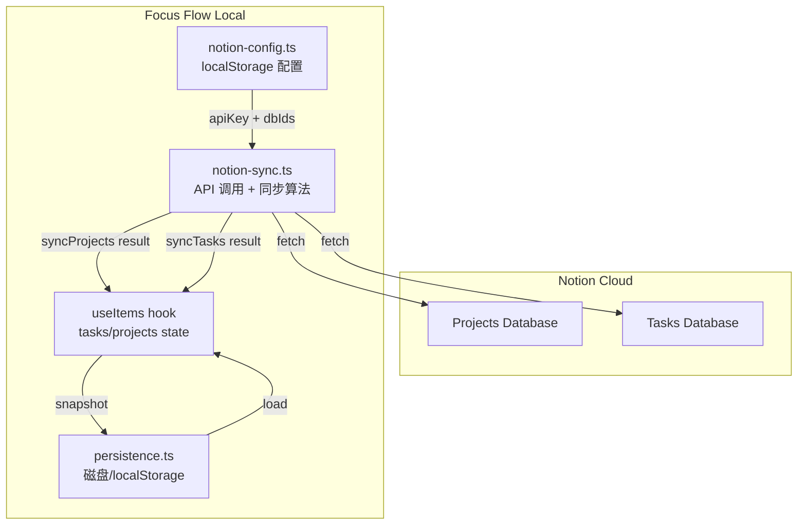
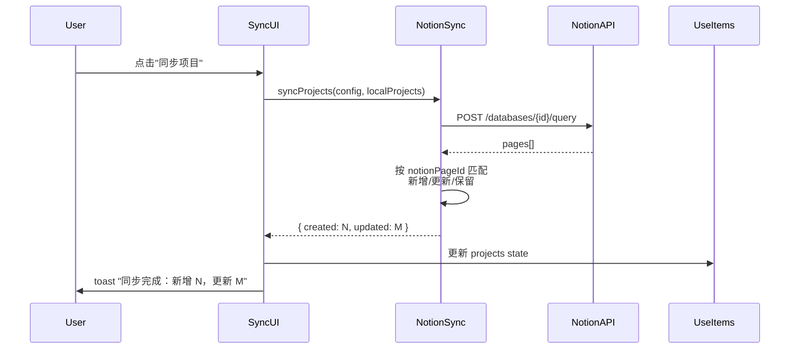

# Design Document: Notion Task Layer

## Overview

为 Focus Flow 引入 Task 中间层，建立 Project → Task → Item 三层数据模型，并通过 Notion API 单向同步 Project 和 Task 数据。

**核心设计决策及其根本原因：**

1. **Notion 为真相源，本地为只读副本** — 用户已在 Notion 维护项目与迭代结构，Focus Flow 的价值在于执行层拆分而非项目规划。如果允许本地创建 Task，会产生"Notion 中不存在的 Task"，破坏单向同步语义，导致数据冲突无法自动解决。
2. **本地 id 关联，notionPageId 仅做去重键** — Notion page id 是外部系统的标识符，如果用它做本地引用键，Notion 端的任何重组（删除重建页面）都会导致本地引用断裂。用本地 UUID 做引用，notionPageId 仅在同步时用于匹配，引用关系对外部变化免疫。
3. **同步操作手动触发，不自动轮询** — 自动轮询需要后台进程管理、冲突检测、网络状态监听等复杂机制，且 Notion API 有速率限制（3 req/s）。手动触发让用户掌控同步时机，实现简单且可预测。
4. **Tauri 环境直接 fetch，浏览器环境禁用同步** — Tauri 的 webview 不受 CORS 限制（请求从本地应用发出，不经过浏览器同源策略）。纯浏览器环境下 Notion API 不支持 CORS，无法直接调用。与其引入代理服务器增加部署复杂度，不如明确限制：同步功能仅在桌面端可用。
5. **不引入新运行时依赖** — Notion API 是标准 REST API，fetch + JSON 解析完全胜任。引入 SDK 会增加包体积且引入版本管理负担，而实际只需要 query database 和 read page 两个端点。

## Architecture

### 模块层次

```
src/lib/
├── focus-flow-model.ts    # 扩展：Task 类型定义、DEFAULT_TASK 常量
├── persistence.ts         # 扩展：PersistedSnapshot 增加 tasks 字段
├── notion-sync.ts         # 新增：Notion API 调用 + 同步算法
└── notion-config.ts       # 新增：配置读写（localStorage）

src/hooks/
└── use-items.ts           # 扩展：tasks 状态管理、Task CRUD

src/components/focus-flow/
├── quick-capture.tsx      # 扩展：Task 选择控件
├── edit-item-modal.tsx    # 扩展：Task 选择控件
├── toolbar-menu.tsx       # 扩展：Notion 设置 + 同步按钮入口
└── notion-settings-modal.tsx  # 新增：Notion 配置弹窗
```

### 数据流



### 同步算法流程



## Components and Interfaces

### 1. notion-config.ts — 配置管理模块

**文件：** `src/lib/notion-config.ts`

```typescript
export const NOTION_CONFIG_KEY = "focus-flow-notion-config-v1";

export type NotionConfig = {
  apiKey: string;
  projectsDbId: string;
  tasksDbId: string;
};

export function loadNotionConfig(): NotionConfig | null;
export function saveNotionConfig(config: NotionConfig): void;
export function isNotionConfigComplete(config: NotionConfig | null): boolean;
```

**设计决策：** 配置存储在独立的 localStorage key 中，不混入 PersistedSnapshot。原因：
- 配置包含 API Key（敏感信息），不应随数据导出/备份传播
- 配置与数据的生命周期不同（数据频繁变更，配置很少改动）
- 避免 Tauri 磁盘文件中出现明文 API Key

### 2. notion-sync.ts — 同步服务模块

**文件：** `src/lib/notion-sync.ts`

```typescript
export type SyncProjectsResult = {
  created: number;
  updated: number;
  unchanged: number;
};

export type SyncTasksResult = {
  created: number;
  updated: number;
  skipped: number;
  unchanged: number;
};

export type NotionPage = {
  id: string;           // Notion page id
  name: string;         // 从 Name 属性提取
  projectRelationIds: string[];  // 仅 Task 页面有，关联的项目 page ids
};

// 从 Notion API 响应中提取页面列表
export function fetchNotionPages(
  apiKey: string,
  databaseId: string,
): Promise<NotionPage[]>;

// 项目同步算法（纯函数，不含副作用）
export function reconcileProjects(
  notionPages: NotionPage[],
  localProjects: Project[],
): { nextProjects: Project[]; result: SyncProjectsResult };

// Task 同步算法（纯函数，不含副作用）
export function reconcileTasks(
  notionPages: NotionPage[],
  localTasks: Task[],
  localProjects: Project[],
): { nextTasks: Task[]; result: SyncTasksResult };
```

**关键设计决策：**

- **reconcile 函数是纯函数** — 接收当前状态和 Notion 数据，返回新状态。不直接修改 state，不调用 API。这使得同步算法可以独立于 UI 和网络层进行单元测试和属性测试。
- **fetchNotionPages 封装 API 调用** — 处理分页（Notion API 单次最多 100 条）、请求头、错误转换。调用方只需处理 NotionPage[] 或 Error。
- **API 版本固定为 `2022-06-28`** — 这是 Notion API 的稳定版本，不随 Notion 产品更新自动升级，避免意外破坏。

### 3. useItems hook 扩展

**文件：** `src/hooks/use-items.ts`

新增状态和方法：

```typescript
// 新增状态
const [tasks, setTasks] = useState<Task[]>([]);

// 新增方法
function getTaskById(id?: string): Task | undefined;
function getTasksForProject(projectId: string): Task[];
function applyProjectSync(nextProjects: Project[]): void;
function applyTaskSync(nextTasks: Task[]): void;

// PersistedSnapshot 扩展
type PersistedSnapshot = {
  // ...existing fields
  tasks: unknown[];  // 新增
};
```

### 4. QuickCapture 扩展

**文件：** `src/components/focus-flow/quick-capture.tsx`

新增 props 和状态：

```typescript
type QuickCaptureProps = {
  // ...existing props
  tasks: Task[];  // 新增：全部 Task 列表
};

// 组件内新增状态
const [selectedTaskId, setSelectedTaskId] = useState<string>("__default__");

// 当 selectedProject 变化时重置 selectedTaskId
useEffect(() => {
  setSelectedTaskId("__default__");
}, [selectedProject]);
```

### 5. EditItemModal 扩展

**文件：** `src/components/focus-flow/edit-item-modal.tsx`

新增 props：

```typescript
type EditItemModalProps = {
  // ...existing props
  tasks: Task[];  // 新增：全部 Task 列表
};
```

### 6. NotionSettingsModal — 新组件

**文件：** `src/components/focus-flow/notion-settings-modal.tsx`

```typescript
type NotionSettingsModalProps = {
  onClose: () => void;
  onSave: (config: NotionConfig) => void;
  initialConfig: NotionConfig | null;
};

export function NotionSettingsModal({
  onClose,
  onSave,
  initialConfig,
}: NotionSettingsModalProps): JSX.Element;
```

### 7. ToolbarMenu 扩展

在"设置"分组中新增：
- "Notion 设置" — 打开 NotionSettingsModal
- "同步项目" — 触发项目同步（配置不完整时 disabled）
- "同步 Task" — 触发 Task 同步（配置不完整时 disabled）

### 8. CORS 处理

```typescript
// src/lib/notion-sync.ts 内部

async function isTauriRuntime(): Promise<boolean> {
  if (typeof window === "undefined") return false;
  return "__TAURI_INTERNALS__" in window;
}

export async function checkSyncAvailability(): Promise<{
  available: boolean;
  reason?: string;
}> {
  if (await isTauriRuntime()) {
    return { available: true };
  }
  return {
    available: false,
    reason: "Notion 同步仅在桌面端可用（浏览器环境受 CORS 限制）",
  };
}
```

**为什么不用 Tauri HTTP 插件：** Tauri 2 的 webview 本身就不受 CORS 限制（与 Electron 类似），直接用 fetch 即可。引入 HTTP 插件会增加 Rust 编译依赖和权限配置复杂度，没有实际收益。

## Data Models

### Task 类型定义

```typescript
export type Task = {
  id: string;            // 本地 UUID，作为 Item.taskId 的引用目标
  name: string;          // 从 Notion Name 字段同步
  projectId: string;     // 本地 Project.id，通过 Notion relation 解析
  notionPageId: string;  // Notion page id，同步去重键
  createdAt: string;     // ISO 字符串，首次同步时间
  updatedAt: string;     // ISO 字符串，最近同步更新时间
};
```

**为什么 Task 没有 status 字段：** Notion 端的 Task 状态（进行中/已完成）不影响 Focus Flow 的本地行为。Focus Flow 关心的是 Item 的执行状态，不是 Task 的规划状态。引入 status 会产生"本地 Task 状态与 Notion 不一致"的同步问题，而这个状态在本地没有消费场景。

### Project 类型扩展

```typescript
export type Project = {
  id: string;
  name: string;
  color: string;
  notionPageId?: string;  // 新增：可选，Notion 同步的项目才有
};
```

**为什么 notionPageId 是可选的：** 本地默认项目（id: "default"）和用户手动创建的项目没有 Notion 对应物。强制要求 notionPageId 会破坏现有数据兼容性。

### Item 类型扩展

```typescript
export type Item = {
  // ...existing fields
  taskId?: string;  // 新增：可选，引用 Task.id
};
```

### DEFAULT_TASK 常量

```typescript
export const DEFAULT_TASK_ID = "__default__";
export const DEFAULT_TASK_NAME = "未分类";
```

**为什么用特殊常量而非 null：** UI 选择控件需要一个明确的"未选择"值来渲染。用 `null` 作为 select value 在 React 中会产生 uncontrolled/controlled 切换警告。用特殊 ID 字符串让 select 始终是 controlled 组件，且在保存时转换为 `undefined`（不存储到 Item 上）。

### PersistedSnapshot 扩展

```typescript
export type PersistedSnapshot = {
  version: number;       // 保持 1，通过 tasks 字段存在性判断是否有 Task 数据
  exportedAt: string;
  items: unknown[];
  projects: unknown[];
  tags: unknown[];
  tasks: unknown[];      // 新增
  reports: { date: string; content: string }[];
  sessionStats?: DailySessionStats;
};
```

**为什么不升级 version 号：** 新增字段是向后兼容的（旧版本加载时 tasks 为 undefined，代码用 `|| []` 降级）。升级 version 需要迁移逻辑，增加复杂度但没有实际收益。

### NotionConfig 存储

```typescript
// localStorage key: "focus-flow-notion-config-v1"
// 值结构：
{
  apiKey: string;       // Notion Integration Token
  projectsDbId: string; // Projects 数据库 ID
  tasksDbId: string;    // Tasks 数据库 ID
}
```

### 同步算法伪代码

**reconcileProjects:**

```
输入: notionPages[], localProjects[]
输出: nextProjects[], stats

对每个 notionPage:
  在 localProjects 中查找 notionPageId === notionPage.id 的项目
  如果找到:
    如果名称不同 → 更新名称，stats.updated++
    否则 → stats.unchanged++
  如果未找到:
    创建新 Project（新 UUID, name=notionPage.name, notionPageId=notionPage.id, color=随机）
    stats.created++

保留所有 localProjects（包括 notionPageId 不在本次结果中的）
```

**reconcileTasks:**

```
输入: notionPages[], localTasks[], localProjects[]
输出: nextTasks[], stats

对每个 notionPage:
  取其 projectRelationIds[0]（第一个关联项目的 Notion page id）
  在 localProjects 中查找 notionPageId === projectRelationId 的项目
  如果找不到对应 Project → stats.skipped++, continue

  在 localTasks 中查找 notionPageId === notionPage.id 的 Task
  如果找到:
    如果名称不同 → 更新名称，stats.updated++
    否则 → stats.unchanged++
  如果未找到:
    创建新 Task（新 UUID, name=notionPage.name, projectId=匹配到的Project.id, notionPageId=notionPage.id）
    stats.created++

保留所有 localTasks（包括 notionPageId 不在本次结果中的）
```


## Correctness Properties

*A property is a characteristic or behavior that should hold true across all valid executions of a system—essentially, a formal statement about what the system should do. Properties serve as the bridge between human-readable specifications and machine-verifiable correctness guarantees.*

### Property 1: Item-Task-Project 一致性不变量

*For any* Item that has a non-empty taskId referencing a Task, the Item's projectId SHALL equal that Task's projectId.

**Validates: Requirements 1.2, 1.3**

### Property 2: 配置持久化 round-trip

*For any* valid NotionConfig (apiKey, projectsDbId, tasksDbId 均为非空字符串), calling `saveNotionConfig(config)` then `loadNotionConfig()` SHALL return an object with identical field values.

**Validates: Requirements 2.2, 2.3**

### Property 3: 不完整配置禁用同步

*For any* NotionConfig where at least one field (apiKey, projectsDbId, tasksDbId) is an empty string, `isNotionConfigComplete(config)` SHALL return false.

**Validates: Requirements 2.5**

### Property 4: 项目同步 — 新增、更新、保留

*For any* set of Notion pages and local Projects:
- A Notion page whose notionPageId does not match any local Project SHALL result in a new Project being created with that page's name
- A Notion page whose notionPageId matches a local Project with a different name SHALL result in that Project's name being updated
- A local Project whose notionPageId is not present in the Notion pages set SHALL be retained unchanged in the output

**Validates: Requirements 3.3, 3.4, 3.5, 3.6**

### Property 5: Task 同步 — 新增、更新、跳过、保留

*For any* set of Notion Task pages, local Tasks, and local Projects:
- A Notion Task page whose project relation resolves to a local Project and whose notionPageId does not match any local Task SHALL result in a new Task being created
- A Notion Task page whose project relation resolves to a local Project and whose notionPageId matches a local Task with a different name SHALL result in that Task's name being updated
- A Notion Task page whose project relation does NOT resolve to any local Project SHALL be skipped and counted in the skipped statistic
- A local Task whose notionPageId is not present in the Notion Task pages set SHALL be retained unchanged

**Validates: Requirements 4.3, 4.4, 4.5, 4.6, 4.7, 4.8**

### Property 6: 同步失败原子性

*For any* initial local state (Projects or Tasks), if the Notion API call throws an error, the state after the sync attempt SHALL be identical to the state before the attempt.

**Validates: Requirements 3.7, 4.9**

### Property 7: Task 选项按 Project 过滤

*For any* selected projectId and any set of Tasks, the visible Task options in the selector SHALL be exactly the set of Tasks where `task.projectId === selectedProjectId`, plus the Default_Task option.

**Validates: Requirements 5.3, 6.1**

### Property 8: 切换 Project 重置 Task 选择

*For any* Project change event in QuickCapture or Item_Editor, the Task selector value SHALL be reset to DEFAULT_TASK_ID immediately after the change.

**Validates: Requirements 5.5, 6.2**

### Property 9: Task 赋值持久化

*For any* Item submission or edit where the Task selector value is a valid Task id (not DEFAULT_TASK_ID), the resulting Item's taskId SHALL equal that Task id. When the selector value is DEFAULT_TASK_ID, the resulting Item's taskId SHALL be undefined.

**Validates: Requirements 5.6, 6.3, 7.4**

### Property 10: 历史数据兼容

*For any* persisted Item data where the taskId field is missing or undefined, loading that data SHALL produce a valid Item object that can be displayed and edited without error, and saving it without changing the Task selector SHALL preserve taskId as undefined.

**Validates: Requirements 7.1, 7.3**

## Error Handling

| 场景 | 处理方式 | 原因 |
|------|----------|------|
| Notion API 返回 401 Unauthorized | 中止同步，toast 显示"API Key 无效或已过期" | 用户需要更新配置 |
| Notion API 返回 404 Not Found | 中止同步，toast 显示"数据库 ID 不存在" | 配置的数据库 ID 可能有误 |
| Notion API 返回 429 Rate Limited | 中止同步，toast 显示"请求过于频繁，请稍后重试" | Notion 限速 3 req/s，不做自动重试避免复杂度 |
| Notion API 网络超时/断网 | 中止同步，toast 显示"网络连接失败" | 本地优先应用，网络不可用是正常场景 |
| Notion Task 的 relation 字段为空 | 跳过该 Task，计入 skipped | 用户可能还没给 Task 分配项目 |
| Notion Task 关联多个项目 | 取第一个关联项目 | Notion relation 支持多选，但 Focus Flow 的 Task 只属于一个 Project |
| 加载 PersistedSnapshot 时 tasks 字段缺失 | 用空数组 `[]` 降级 | 向后兼容旧版本数据 |
| 加载 NotionConfig 时 JSON 解析失败 | 返回 null，视为未配置 | 不阻塞应用启动 |
| 浏览器环境尝试同步 | 同步按钮 disabled + tooltip 提示"仅桌面端可用" | CORS 限制无法绕过 |
| 同步过程中用户关闭应用 | 无特殊处理，下次同步会重新拉取完整数据 | 同步是幂等操作，中断不会导致数据损坏 |

## Testing Strategy

### 属性测试（Property-based）

使用 `fast-check` 库，每个属性测试最少 100 次迭代。

核心测试目标是 `reconcileProjects` 和 `reconcileTasks` 两个纯函数——它们封装了同步的全部业务逻辑，输入输出明确，无副作用，非常适合 PBT。

| 属性 | 生成器 | 验证 |
|------|--------|------|
| Property 1 | 随机 Items + Tasks，确保 Item.taskId 引用有效 Task | Item.projectId === Task.projectId |
| Property 2 | 随机非空字符串三元组 | save → load round-trip 相等 |
| Property 3 | 随机字符串三元组，至少一个为空 | isNotionConfigComplete 返回 false |
| Property 4 | 随机 NotionPage[] + 随机 Project[] | reconcileProjects 输出满足新增/更新/保留规则 |
| Property 5 | 随机 NotionPage[] + 随机 Task[] + 随机 Project[] | reconcileTasks 输出满足新增/更新/跳过/保留规则 |
| Property 6 | 随机初始状态 | 模拟 API 抛错后状态不变 |
| Property 7 | 随机 projectId + 随机 Task[] | 过滤结果 === tasks.filter(t => t.projectId === pid) + default |
| Property 8 | 随机 project 切换序列 | 每次切换后 selectedTaskId === DEFAULT_TASK_ID |
| Property 9 | 随机 taskId 选择 + Item 提交 | 结果 Item.taskId 与选择一致 |
| Property 10 | 随机 Item 数据（taskId 缺失） | 加载成功 + 保存后 taskId 仍为 undefined |

**标签格式：** `Feature: notion-task-layer, Property {N}: {property_text}`

**为什么 reconcile 函数是 PBT 的理想目标：**
- 纯函数：相同输入必然相同输出，无副作用
- 输入空间大：项目数量、名称、notionPageId 组合无限
- 边界情况多：空列表、全部匹配、全部新增、名称含特殊字符
- 100 次迭代能覆盖手写用例难以想到的组合

### 单元测试（Example-based）

针对具体场景和边界条件：

1. **配置 UI** — 三个输入框渲染、保存按钮行为、已有配置回显
2. **同步按钮状态** — 配置不完整时 disabled、同步中 loading、浏览器环境 disabled
3. **Toast 反馈** — 成功时显示统计数字、失败时显示错误摘要
4. **Task 选择器默认值** — 首次渲染为"未分类"
5. **历史 Item 渲染** — taskId 为空的 Item 正常显示
6. **Notion API 响应解析** — 从真实 API 响应格式中正确提取 name 和 relation

### 集成测试

1. **Notion API mock** — 使用 MSW 或手动 mock fetch，验证完整同步流程（调用 API → reconcile → 更新 state → 持久化）
2. **数据迁移** — 加载不含 tasks 字段的旧版 snapshot，验证应用正常启动且 tasks 为空数组
